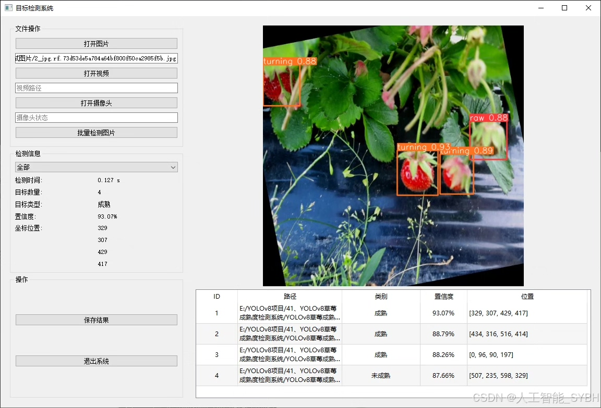
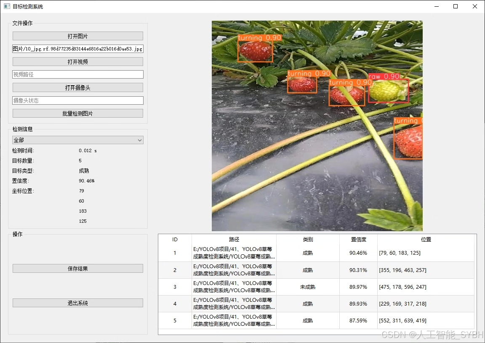
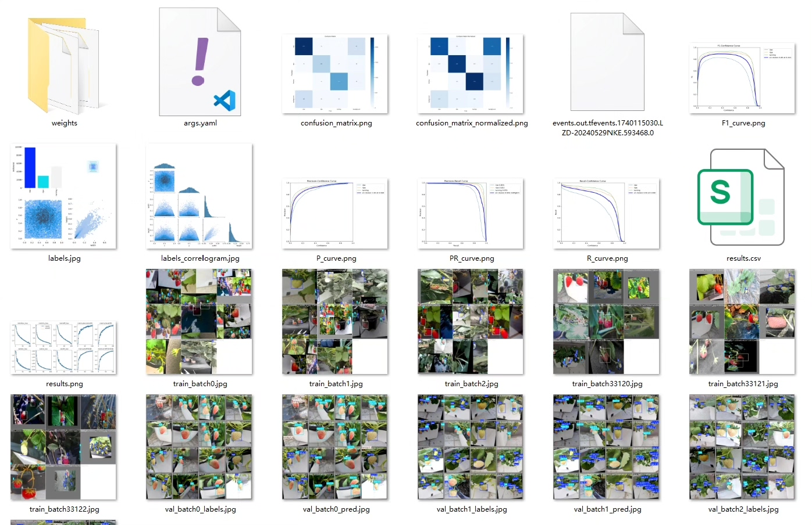
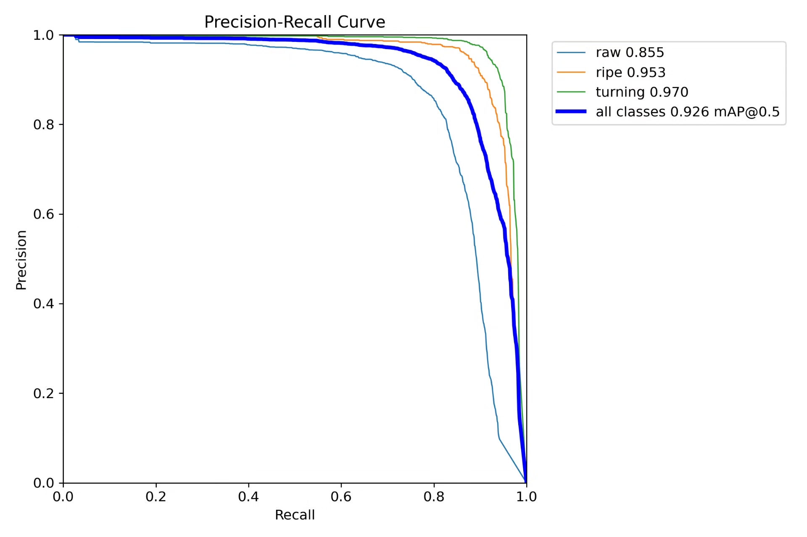
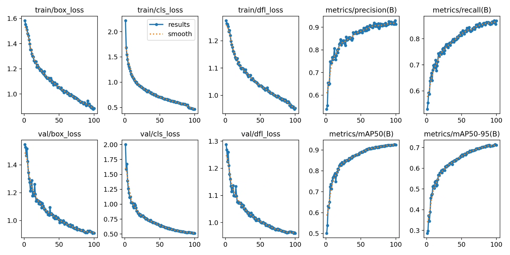
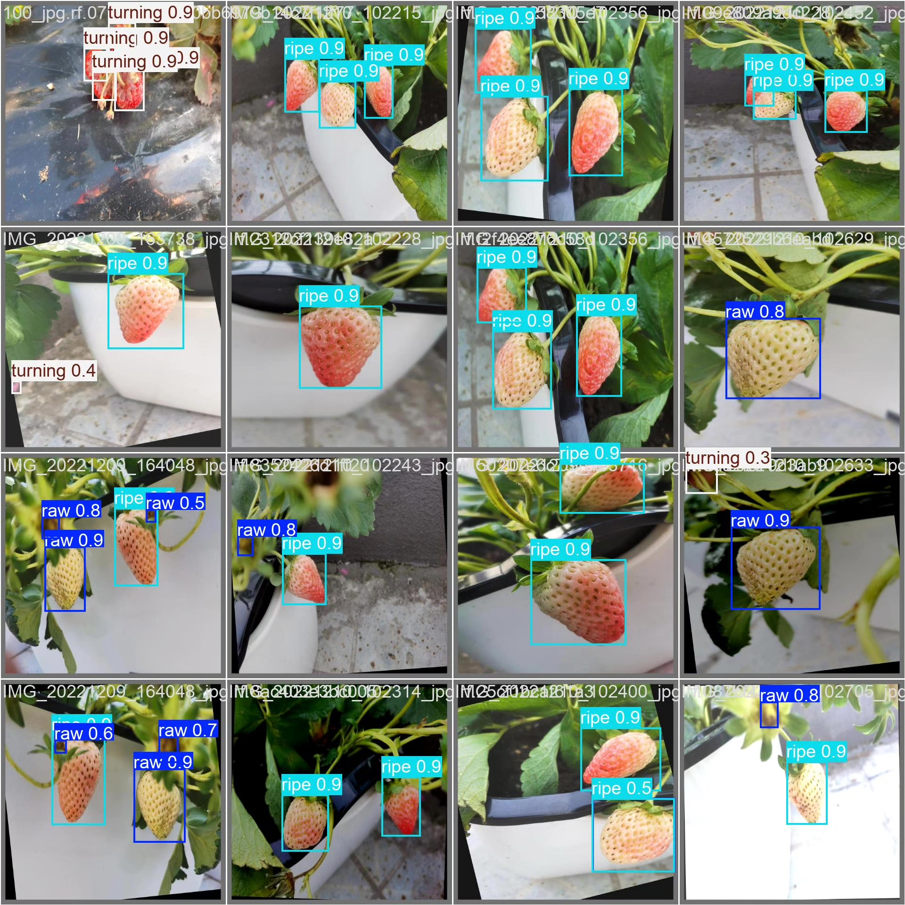
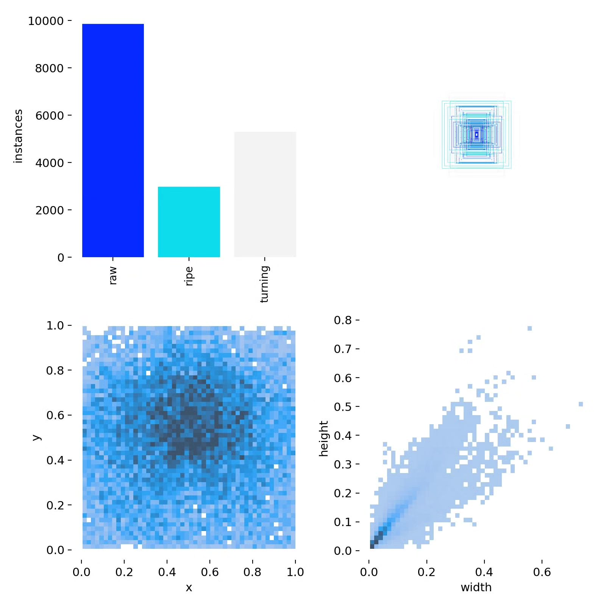
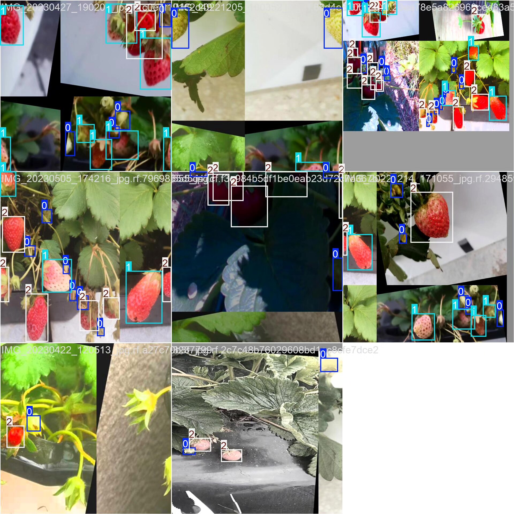

# Sweet berry maturity detection system based on YOLOv8 deep learning (YOLOv8+)

## Body

Based on the YOLOv8 deep learning algorithm, a strawberry maturity detection system has been developed. This project utilizes the YOLOv8 object detection algorithm to create an efficient and accurate automatic strawberry maturity detection system. The system categorizes strawberry maturity into three categories: unripe (raw), ripe (ripe), and turning (turning). Through computer vision technology, real-time recognition and classification of strawberry maturity states are achieved. The project uses high-quality self-built datasets for training and validation, with a training set containing 2939 labeled images and a validation set containing 774 images, covering samples of strawberries under different lighting conditions, shooting angles, and maturity stages, ensuring the model's generalization capability. The system can be deployed on embedded devices, mobile terminals, or cloud platforms, suitable for agricultural automation scenarios such as orchard inspection, intelligent sorting, and unmanned picking, significantly improving the production efficiency and level of intelligence in the strawberry industry.

The company's products have obtained the official commercial license certification from YOLO.

We provide after-sales service.

After payment, we will provide WeChat ID for any questions.

Environment configuration: We will provide a tutorial on environment configuration, and WeChat will provide answers.

Remote installation service: If you need remote configuration, an additional fee of 69 is required,
if the configuration fails, all fees will be refunded (for special old computers only refund installation fees)

Retraining dataset: After setting up the environment, you can train on your own computer.
If you need us to retrain, just pay 69+ computing power fees (2.5 yuan/hour)

## Images

## Payment

Here is a pay link on Stripe ( https://buy.stripe.com/3cs8yP7sY87d0vu9AB ). Please contact me lonlonago@foxmail.com after funding $89, and I will send you a complete data files , thank you!

